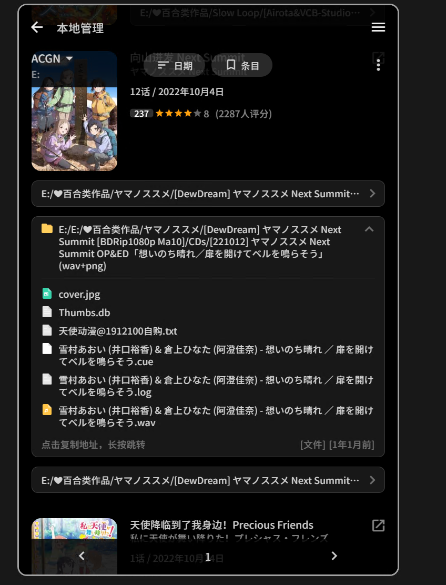

谢邀(bgm38)  
大概看了一下，应该有那么百分之七八十，每页基本都有一两个匹配出错，后面几页就多起来了  
识别的其它问题主要还是不认识动漫，导致某些动漫条目下识别出来文件夹过多：  
1.向山进发把CD识别出来了  
  

2.昨日之歌把漫画识别出来了(当然这是个例，昨日之歌我估计是忘了打包成cbz，其他有漫画的我基本都是打包成cbz，就没识别出来)  
  

3.季度识别问题，这个估计是我的文件夹命名问题  
  
夏目(M2的Rip，季度文件夹以“S1-5”来区分)就只识别出了第一季，其他季度都如图跟第一季放在一起，而识别出来的季度都是我之前还没删除的字幕。  
像《摇曳百合》和“点兔”这种季度命名做了区分且文件夹也相应做了区分的就没识别问题  


也可能是我文件夹命名不规范b38  
我下过的动漫在我BGM的目录也有记录，加上我也不用emby、jellyfin、flex之类的媒体管理软件，自己下过的东西都是自己手动管理。主要是以动画为主，很喜欢的作品就会补齐它的原作或者其他形式的内容载体，所以我这个文件夹下ACGNM各种类型的文件都有  

基本规范如下：  
```
C:[分类]/[作品名]/[Anime]/[Rip名]/xxx.mkv
    #当然某些动画会有下面这种分类就是了
    C:[分类]/[作品名]/[Anime]/[BDRip]/[Rip名]/xxx.mkv
    C:[分类]/[作品名]/[Anime]/[Blu-ray Disc]/xxx.iso
C:[分类]/[作品名]/[Comic]/[JP]/xxx.cbz
C:[分类]/[作品名]/[Game]/xxx.rar
C:[分类]/[作品名]/[Novle]/xxx.epub
```

